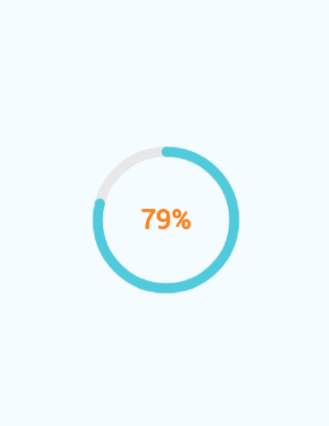

[]()
[](https://www.npmjs.com/package/react-native-percent-circle)
[](https://www.npmjs.com/package/react-native-percent-circle)

# react-native-percent-circular

React Native component for creating animated, circular progress with Pure js. Useful for displaying users points for example. **Works on iOS & Android.**


## Example app


## Installation

 Install library  `npm i --save react-native-percent-circle`

## Usage

Import PercentCircle.

```js
import PercentCircle from 'react-native-percent-circle';
```

Use as follows:

```jsx
  <PercentCircle percent={79} aninationType="Quad.easeInOut"/>
```

## Configuration

You can configure the passing by following props:

- **radius** – the radius of the circle
- **percent** - current, percentage fill (from 0 to 100)
- **frameTime** - the time of refresh circle
- **fwColor** - color of a progress line
- **bgColor** - color of a background for progress line
- **duration** - the time of animation
- **lineCap** - the shape to be used at the ends of the circle. Possible values:  round or square or none.
- **fontColor** - the color of font
- **fontSize** - the size of font (px)
- **animationType** - animation types,exmaple: **'Quad.easeInOut'** ,Possible values see tween.js

## Author

Hlere (595806119@qq.com)

## License

MIT
